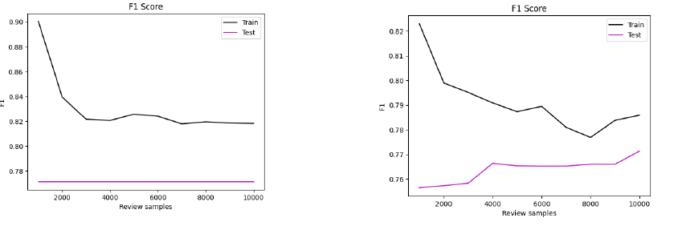

# Text Category Assignment

AUEB Informatics

Project 2 for the course "Artificial Intelligence" 5th semester 2023 - 2024

*Avrabos Georgios - p3210001* 
*Gasparhs Rhgos - p3210174* 
*Griva Aggelikh Aikaterinh - p3210041*  

## Project Description

In this project we have implemented 3 machine learning algorithms to classify given text into two categories: positive/negative. The algorithms are the following:

**- Naive Bayes** 
**- Random Forest** 
**- Adaboost**

The project is split into 3 phases: 1) First create the algorithms from scratch, using only numpy and basic computational libraries. 2) Use already implemented algorithms from libraries such as Scikit-learn, Keras etc. and compare the results with the ones of the first phase. 3) Create a MLP with sliding window or RNN.

For our data we use the "IMDB Dataset" (or "Large Movie Review Dataset") which can be found here https://keras.io/api/datasets/imdb. Based on the documentation we create our dataset and use it for the training and testing of the algorithms.

For our vocabulary we search for a range of words that skips very common words which will not help the algorithms determine much and we also want to skip very rare words. For example the word "the" is the most used word in the english language. It would be foolish if we allowed our algorithms to examine this word and account it for their final decision, since this word can be equally found in both positive and negative sentences. On the other hand the word "conundrum" for instance, will be of such low occurance that again, it will not aid the algorithms for an accurate final decision.

## Naive Bayes

### Accuracy and precision diagrams

Our Bayes

Scikit-learn's Bayes

### Recall and F1 diagrams

Our Bayes

Scikit-learn's Bayes

*Credit: Griva Aggelikh Aikaterinh*

## Random Forest

### Accuracy

### Precision

### Recall

### F1

*Credit: Gasparhs Rhgos*

## Adaboost

#### [Adaboost's implementation can be found here.](Adaboost.ipynb)

### Accuracy

### Precision

### Recall

### F1

*Credit: Avrabos Georgios*